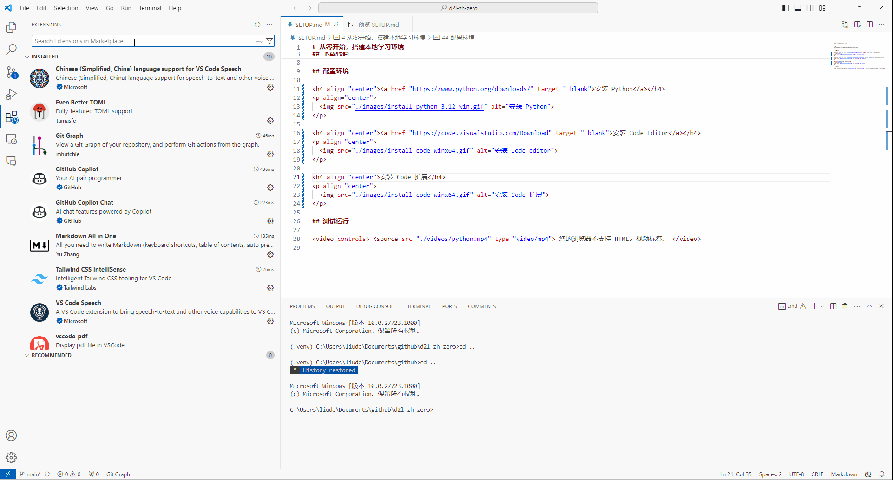
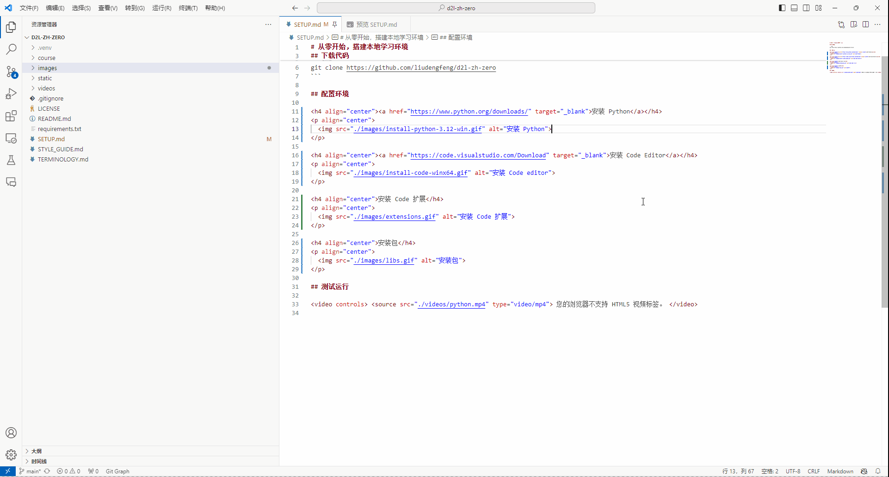
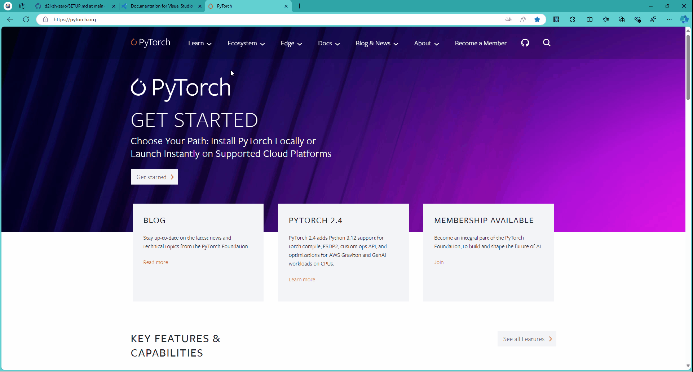
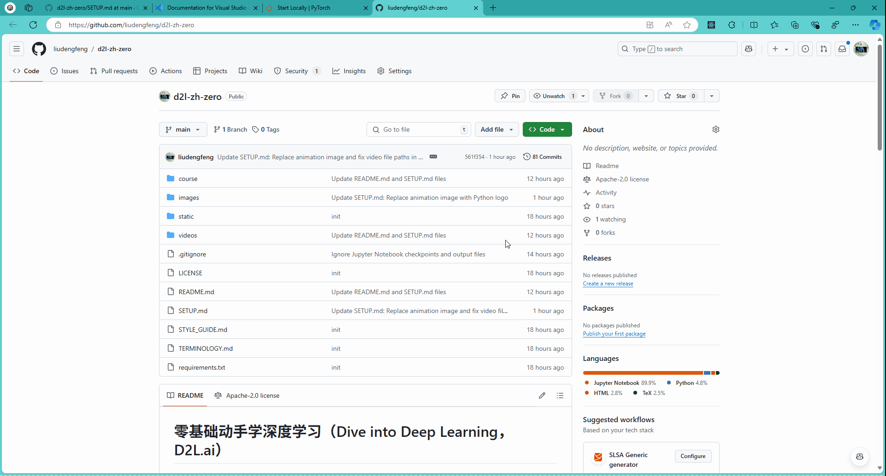

# 从零开始，搭建本地学习环境

## 配置环境

<h4 align="center"><a href="https://www.python.org/downloads/" target="_blank">安装 Python</a></h4>

  

<h4 align="center"><a href="https://code.visualstudio.com/Download" target="_blank">安装 Code Editor</a></h4>

  

<h4 align="center">安装 Code 扩展</h4>

  

<h4 align="center">配置运行环境-1</h4>

  

<h4 align="center">配置运行环境-2</h4>

  

## 运行

<h4 align="center"><a href="https://github.com/liudengfeng/d2l-zh-zero" target="_blank">下载代码</a></h4>

  

<h4 align="center"><a href="https://github.com/liudengfeng/d2l-zh-zero" target="_blank">下载代码</a></h4>

  

