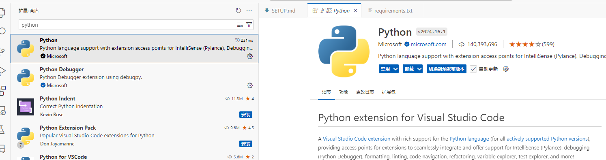
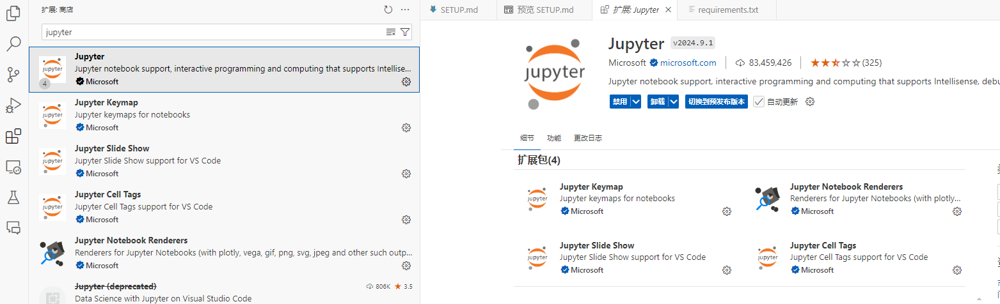

# 从零开始，搭建本地学习环境

## 下载代码

```cmd
git clone https://github.com/liudengfeng/d2l-zh-zero
```

## 配置环境

+ [安装 `python`](https://www.python.org/downloads/)
+ [安装 `visual studio code`](https://code.visualstudio.com/)
    + 在code中安装扩展
        - python 扩展
    
        - Jupyter 扩展
    
+ [配置环境]

## 测试运行

<video controls> <source src="./videos/env.mp4" type="video/mp4"> 您的浏览器不支持 HTML5 视频标签。 </video>