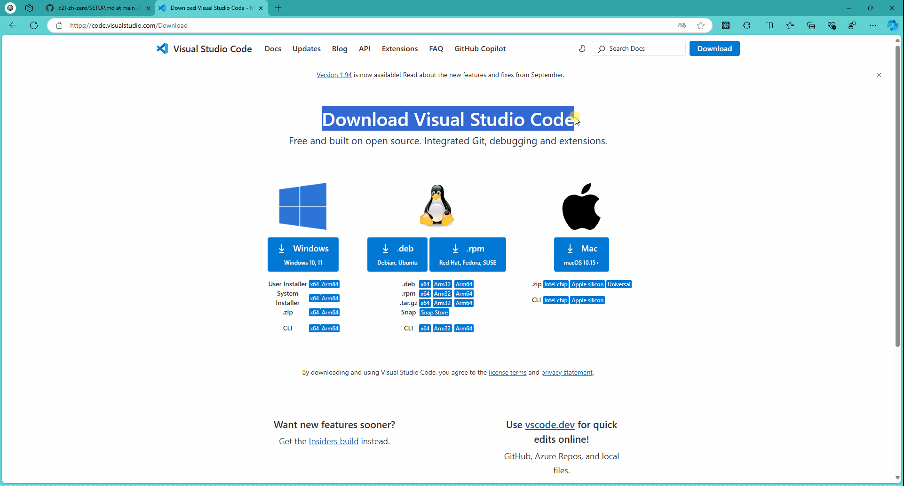

# 从零开始，搭建本地学习环境

## 下载代码

```cmd
git clone https://github.com/liudengfeng/d2l-zh-zero
```

## 配置环境

+ [安装 `python`](https://www.python.org/downloads/)
    <details>
        <summary>显示动图</summary>
        <ul>
            
        </ul>
    </details>

+ [安装 `visual studio code`](https://code.visualstudio.com/Download)
    <details>
        <summary>显示动图</summary>
        <ul>
            
        </ul>
    </details>

+ [安装code扩展`](https://code.visualstudio.com/)


+ [配置环境]
    <details>
        <summary>在code中配置python环境</summary>
        <ul>
            <video controls> <source src="videos/env.mp4" type="video/mp4"> 您的浏览器不支持 HTML5 视频标签。 </video>
        </ul>
    </details>

## 测试运行

<video controls> <source src="./videos/python.mp4" type="video/mp4"> 您的浏览器不支持 HTML5 视频标签。 </video>
